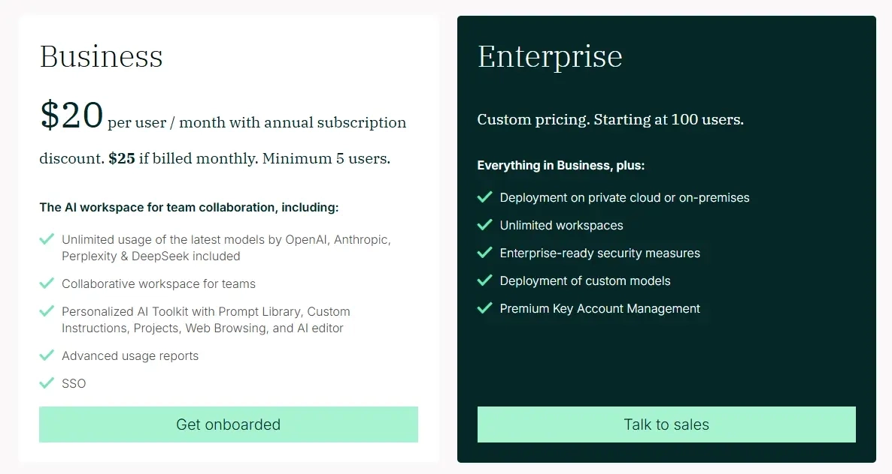
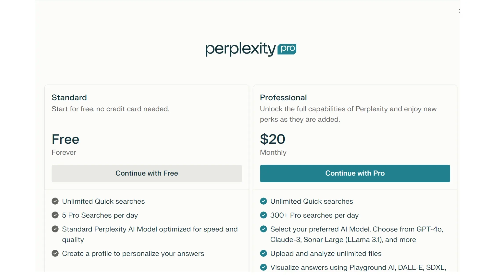
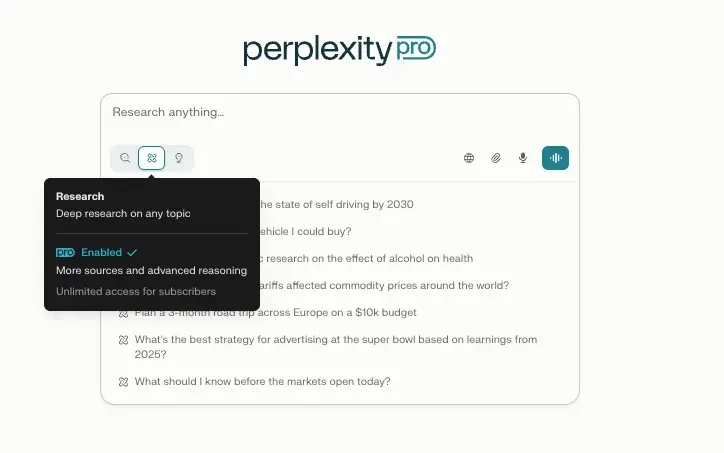
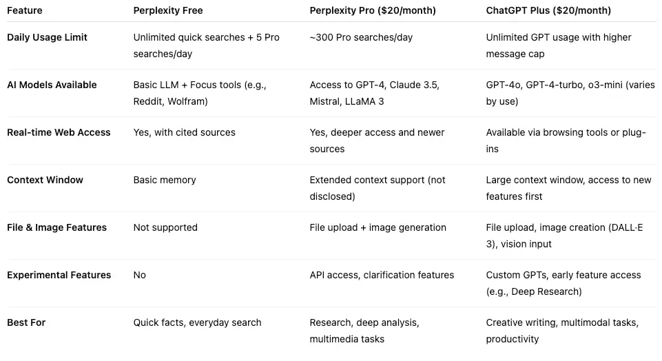
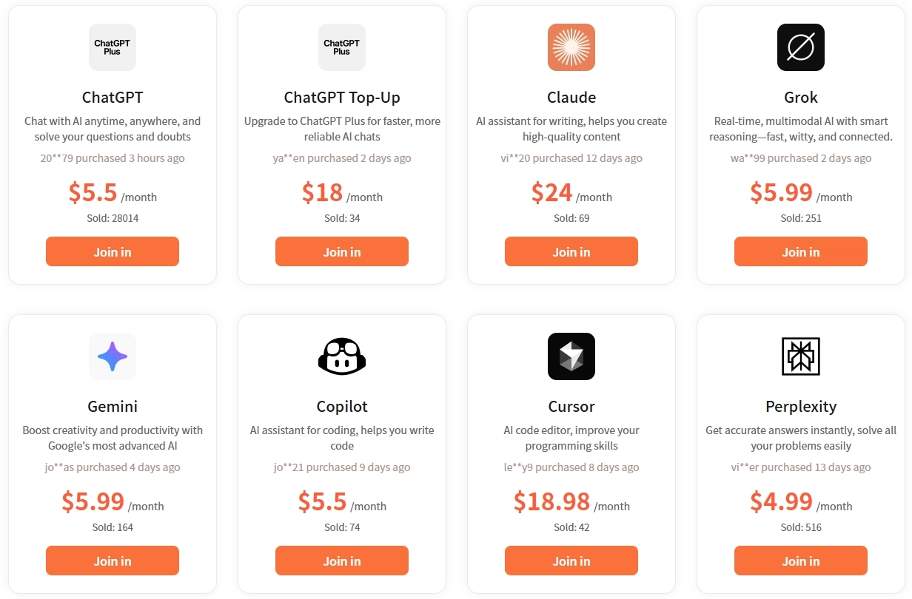

# Perplexity AI 2025定价指南：三个版本怎么选不踩坑

---

你肯定遇到过这种情况：Google搜出来一堆结果，翻半天找不到想要的答案；ChatGPT倒是说得头头是道，但你总担心它在编故事。Perplexity AI就是为了解这个痛设计的——它给答案的同时带着引用来源，让你不用再当侦探去验证真假。

问题来了：这东西要花多少钱？免费版够不够用？Pro版值不值得掏钱？别急，这篇文章把Perplexity的价格体系掰开了讲，帮你找到最适合自己的方案。

---

## Perplexity的三档价格：从白嫖到土豪都有选择

Perplexity用的是阶梯定价：免费版（$0）、Pro版（$20/月）、企业版（$40/月/人）。不管你是好奇宝宝还是企业团队，基本都能找到合适的档位。

说实话，我一开始也怀疑——又一个AI工具想掏我钱包。但用了几天免费版后，发现自己每天都在撞使用上限。这时候你就明白了，不是套路，是真的有用。

## 免费版：真的能用，不是摆设

大多数"免费"AI工具其实就是试用版的另一个说法，但Perplexity的免费版是真能干活的。

**搜索额度（其实够用）：**

- 基础搜索无限次——问"摩洛哥首都是哪"或"红酒渍怎么洗"，随便问
- 每天5次"Pro搜索"——这是深度挖掘的那种，能找到更详细的信息
- 每4小时重置一次，不是每天重置（我一开始也搞错了）

我的用法是：用基础搜索了解大概，把Pro搜索留给复杂问题。聪明地用这5次，其实能解决不少事。

**文件上传：** 每天3个文档。听起来抠门，但对大多数人够了。我用它：

- 检查文章里引用的资料是否靠谱
- 快速总结PDF报告
- 分析网上找到的数据截图

**智能搜索：** 这个功能挺聪明。你可以指定搜索范围：

- Reddit——想听真人意见，不想看营销软文
- YouTube——找教程，不想翻一堆无关视频
- 学术来源——教授要求引用正经文献的时候

**谁适合用免费版？**

- 还没写毕业论文的学生
- 偶尔需要查证信息的人
- 不确定自己会不会经常用AI搜索的人
- 已经被各种订阅费压垮的人（我懂）

**什么时候该升级？** 相信我，你会知道的。就是那个时刻——你开始精打细算地省着用Pro搜索，或者想"要是能上传整份报告就好了"。

## Pro版：每月$20，但值

这个价位相当于少喝几杯咖啡，但能每周省下好几个小时。

### 搜索次数的差距很大

不用再像守财奴一样省着用5次搜索了，Pro版给你每天300+次。说实话，我最忙的时候也没用完过。

### AI模型自助餐

这可能是我最喜欢的部分。不用被困在一个AI大脑里，你可以选：

- GPT-4：超级聪明，但有时候思考时间长
- Claude 3：写东西很棒，感觉更像和人聊天
- Sonar Large：Perplexity自己的模型，搜索能力强

**实际场景：** 你在研究"适合小团队的项目管理软件"。用Pro版，你可以：

1. 用GPT-4做全面分析
2. 切换到Claude写总结
3. 用Sonar快速追问细节

都在同一个研究过程里完成！

### 文件上传自由

- 无限上传：分析整篇研究论文、财务报告、法律文件
- 多种格式：PDF、CSV、图片，甚至推特截图
- 改变游戏规则的例子：上传50页的市场研究报告，问"这个领域里创业公司有哪3个最大机会？"

### 创意功能（附赠，不是主菜）

还有DALL-E 3图像生成和其他工具。老实说，如果你认真做图，它不如Midjourney。但做博客配图或PPT封面时，不用去翻找素材网站，挺方便。

**谁应该升级：**

- 工作中需要写内容的人（记者、营销人员、咨询师）
- 研究生或做严肃学术研究的人
- 发现自己不止一次被免费版限制搞得很烦的人
- 做市场研究或验证商业想法的创业者

如果你的时间值钱，Pro版回本速度快得离谱。我算过，它每周能帮我省3-4小时研究时间。如果你也在寻找能显著提升研究效率的工具，👉 [Perplexity Pro年费成品号，24H自动发货，365天质保，让你的研究工作事半功倍](https://shaoyumi.com/buy/64)。

## 企业版：每月$40/人

这不只是加了价的Pro版。它是为需要协作的团队和在意数据安全的公司设计的。就像自己开车和需要公司车队的区别。

- 共享工作区：所有人都能访问同一个研究项目
- 知识库：建立全公司的洞察和发现库
- 实际例子：营销团队研究竞争对手策略时，所有人都能贡献到同一个项目，每个人的发现自动整理，随时可查

### 管理控制

- 用户管理：添加/删除团队成员，不会乱套
- 使用监控：看谁在用什么（也许还能看出谁在摸鱼）
- 账单整合：一张发票，不用管20个单独订阅

### 重要的安全功能

- 数据不记录、不用于训练：你的研究就是你的研究
- 组织级隐私控制：设置全公司政策
- 合规就绪：符合企业安全标准

### 文件上传升级

- 每个工作区100+文件：建立全面的研究库
- 团队文件共享：所有人都能访问和分析同样的文档
- 版本控制：不会再问"我们用的是哪个版本的报告？"

### 企业版定价

- 月付：$40/人
- 年付：$400/人
- 学生/非营利组织：符合条件可享5折

老实说：如果你是独立专业人士或小团队，没有严格的安全需求，普通Pro版+良好沟通可能就够了。但如果你经常分享研究，需要铁打的数据处理，多出来的成本能通过生产力提升赚回来。

## Perplexity Max（2025）：顶配选择

Perplexity Max是2025年推出的顶级订阅计划，专为需要更强大能力的用户设计。作为Perplexity AI的旗舰产品，Max提供了几个关键优势：无限使用Labs功能（创建和管理无限数量的仪表板、电子表格、演示文稿和Web应用），优先访问最新AI功能和工具（比如Comet浏览器），还能使用OpenAI的O3-Pro和Anthropic的Claude Opus 4等高级AI模型，处理更复杂的AI任务。Max订阅者还享有专属客户支持，遇到问题能快速得到响应和解决方案。

定价是每月$200或每年$2000（仅限网页端订阅）。这个计划适合专业人士、学术研究人员、内容创作者和需要强大全面AI支持的企业。通过订阅Max，用户能突破免费版的限制，享受无与伦比的AI分析和研究能力，在各自领域获得竞争优势。

Perplexity AI的API定价从Sonar模型的每百万token $0.2到$5不等，Chat模型使用每1000次请求的固定成本加上可变token定价。

- 开发AI应用的程序员
- 自动化研究工作流的企业
- 想把搜索集成到自己工具里的内容创作者
- 对用AI构建东西感兴趣的人（$5的初始额度很适合学习）

## Perplexity和ChatGPT：同样$20，选谁？

在这两者之间选择，就像在瑞士军刀（ChatGPT）和精密研究手术刀（Perplexity）之间选。都是$20/月的高级功能，但它们是为不同工作设计的。

### 我什么时候用Perplexity

**研究和事实核查**

- 实际例子：问两者"阿尔茨海默病的最新临床试验有哪些？"
  - Perplexity：给你2024年的最新试验，附带实际研究链接
  - ChatGPT：可能给你2021年的信息，然后告诉你"请验证此信息"

**来源验证**

- Perplexity：每个说法都有可点击的来源，做学术工作完美
- ChatGPT：听起来很权威，但你得自己去谷歌验证

**时事新闻**

- Perplexity：实时信息，知道昨天发生了什么
- ChatGPT：知识截止日期意味着最近的事件是盲区

### 我什么时候用ChatGPT

**创意写作：**

- ChatGPT：头脑风暴、写作辅助、创意项目都很棒
- Perplexity：也能写,但明显不是主要功能

**对话式AI：**

- ChatGPT：感觉更像和一个知识渊博的朋友聊天
- Perplexity：更像咨询一个非常聪明的图书管理员

Perplexity给你所有东西的可点击链接。ChatGPT就是……不给。如果你做任何需要支撑论点的专业工作，这个差别很大。

但ChatGPT在理解上下文和进行真正对话方面要好得多。就像问图书管理员要事实和跟聪明同事头脑风暴的区别。

### 我的建议

如果只能负担一个，根据你更常做什么来选：

- 选Perplexity：如果你研究、核查事实或写数据驱动的内容
- 选ChatGPT：如果你创作、头脑风暴或需要对话式交互

我认识的大多数认真对待这些工具的人最后都两个都用了。它们是互补的，不是竞争的。

## 省钱妙招：共享计划

为什么要付全价，明明可以用更少的钱获得同样的功能？有些服务比如familypro.io，能让你以低得多的价格获得Pro功能。

- 4人共享计划：每人每月$4.99（省75%——是的，真的！）
- 个人Pro访问：每月$18.99（每年还是能省$12+）

### 为什么选共享Perplexity？

大多数人不会24/7使用Pro功能。你可能密集研究几天，然后几周都不怎么碰它。共享计划让你在需要时访问高级功能，而不用一直付高级价格。

- 学生
- 自由职业者
- 小企业主
- 好奇的专业人士
- 所有想更便宜使用Perplexity Pro的人

注意事项：你不是账户所有者，所以如果有服务问题，你要和共享服务提供商打交道，不是直接和Perplexity。对大多数用户来说，这个权衡完全值得巨大的省钱。

## 实际价值评估

### 免费版

- 适合：高中生、偶尔核查事实的人、试水的人
- 限制：5次Pro搜索的限制比你预期的来得快
- 底线：轻度使用很棒，经常研究会很烦

### Pro版价值主张

- 时间节省：大多数用户报告每周节省2-3小时
- 成本对比：比健身房会员便宜，但对知识工作者来说可能更有用
- 回本点：如果你的时间值$10/小时，每月只需节省2小时就能证明成本合理

### 共享Pro甜蜜点

- 性价比最高：每月$4.99获得完整Pro功能真的很难打
- 风险水平：低。如果不喜欢，你只损失$5，不是$20
- 完美适合：学生、自由职业者、需要Pro功能但看预算的人

### 企业版现实

- 什么时候值得：团队每人每月在研究协调上浪费超过1小时
- 什么时候不值得：独立专业人士或沟通良好的小团队，不需要正式工具
- 隐藏成本：培训团队真正使用协作功能的时间

大多数个人对免费版（如果是轻度用户）或共享Pro计划（如果是常规用户）都很满意。官方Pro和企业版适合需要保证服务水平和直接支持的企业。

## 关于Perplexity AI定价的常见问题（FAQ）

### Perplexity AI可以免费使用吗？

是的，Perplexity AI提供强大的免费计划，包括无限基础搜索和每天5次Pro搜索。免费版包括来源引用、后续问题和基本文件上传，适合休闲研究需求。

### Perplexity Pro多少钱？

Perplexity Pro每月$20或每年$200（节省16.7%）。Pro计划包括每天300+次Pro搜索、访问GPT-4和Claude 3等高级AI模型、无限文件上传和每月$5的API额度。

### 免费版和Pro版有什么区别？

主要区别包括：

- 搜索限制：每天5次Pro搜索 vs. Pro版300+次
- AI模型：仅标准模型 vs. 多个高级模型
- 文件上传：每天3个文件 vs. 无限
- 支持：社区支持 vs. 优先渠道
- API访问：无 vs. 每月$5额度

### 我可以随时取消Perplexity订阅吗？

可以，你可以随时通过账户设置取消Perplexity订阅。**重要：** 在删除账户前取消订阅，以避免继续收费，因为订阅取消和账户删除是分开的流程。

### Perplexity提供学生折扣吗？

Perplexity为符合条件的学生和非营利组织在企业Pro计划上提供50%折扣。联系Perplexity支持申请折扣，他们会审核你的资格。

### Perplexity Pro有免费试用吗？

Perplexity不提供传统的免费试用，但免费计划提供每天5次Pro搜索的高级功能访问。这让你可以在升级前测试高级能力。

### 有更便宜的方式获得Perplexity Pro吗？

有的，像familypro.io这样的共享订阅服务提供显著的成本节省：

- 个人访问：每月$18.99（比官方定价便宜5%）
- 4人共享计划：每人每月$4.99（节省75%）
- 完整Pro功能，包括高级AI模型和无限搜索
- 可靠的账户管理和客户支持

---

在一个找到好信息越来越难的世界里，拥有一个可靠的AI研究助手真的不再是奢侈品了。它只是一个实用工具，恰好能为你省下时间和精力。

从免费访问到企业解决方案，Perplexity AI的灵活定价选项能帮你在功能、成本和使用需求之间找到合适的平衡。年度折扣和无长期承诺让你可以随着研究需求的变化调整计划。👉 [Perplexity Pro年费成品号，24H自动发货，365天质保，让深度研究和实时信息查证不再受限](https://shaoyumi.com/buy/64)，找到最适合自己的方案，不花冤枉钱。
